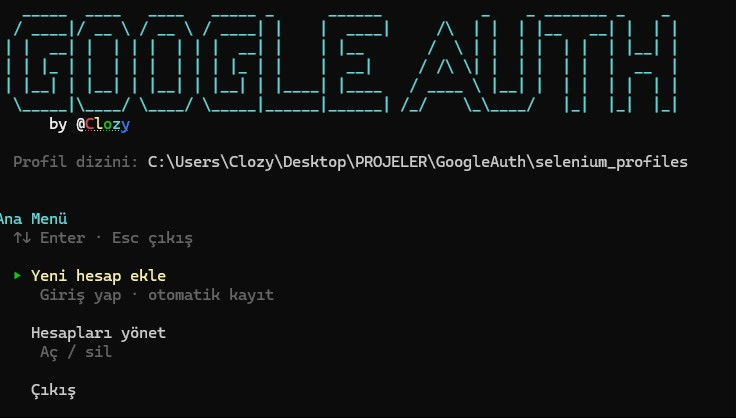

<div align="center">

# GoogleAuth

**İzole Chrome profilleri ile çoklu Google hesap yönetimi**

Kişisel Chrome tarayıcınıza dokunmadan her hesap için ayrı `user-data-dir` oturumu.

[](https://www.python.org/)
[](LICENSE)
[](https://github.com/ultrafunkamsterdam/undetected-chromedriver)

[Özellikler](#özellikler) · [Kurulum](#kurulum) · [Kullanım](#kullanım) · [GitHub'a yükleme](#githuba-yükleme)

</div>



---

## Özellikler

- **Tam izolasyon** — Her hesap proje içindeki `selenium_profiles/` altında (veya `SELENIUM_PROFILES_DIR` ile özel dizin)
- **Kalıcı oturum** — Giriş sonrası Gmail doğrulanır; çerezler diske yazılır
- **Otomatik kayıt** — Gmail açılınca hesap kaydedilir, tarayıcı kapanır
- **Ok tuşu menüsü** — Terminalde ↑↓ ile gezinme
- **Undetected Chrome** — Otomasyon tespitini azaltır
- **Kişisel Chrome'a dokunmaz** — Sistem profiliniz ayrı kalır

---

## Gereksinimler

| | |
|---|---|
| Python | 3.10 veya üzeri |
| Tarayıcı | Google Chrome (güncel) |
| OS | Windows · Linux · macOS |

---

## Kurulum

```bash
git clone https://github.com/TheClozy/GoogleAuth.git
cd GoogleAuth
pip install -r requirements.txt
```

---

## Kullanım

```bash
python main.py
```

### Menü

| | |
|---|---|
| **Yeni hesap ekle** | `accounts.google.com/login` → giriş → Gmail açılınca otomatik kayıt |
| **Hesapları yönet** | Listele · tarayıcı aç · profil sil |
| **Çıkış** | |

---


## Sorun giderme

```powershell
.\scripts\clear_cache.ps1
python main.py
```

**Oturum açılmıyor** — Hesabı silip yeniden ekleyin; Gmail tam açılana kadar bekleyin.

**Log** — `<proje>/selenium_profiles/errors.log`

---

## Güvenlik

İlk kurulumda **`benioku.txt`** dosyasını okuyun. Okuduktan sonra bu dosyayı silin.

- Profil klasörleri oturum çerezleri içerir — paylaşmayın, commit etmeyin
- `.gitignore` `selenium_profiles/` içeriğini hariç tutar
- Google Hizmet Şartlarına uygun kullanın


## Lisans

MIT © [TheClozy](https://github.com/TheClozy) — bkz. [LICENSE](LICENSE)

---

<div align="center">

⭐ Faydalı olduysa yıldız bırakın

</div>
